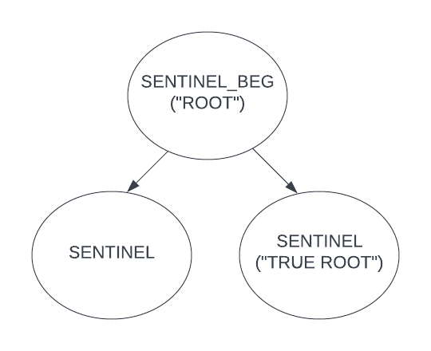

# Concurrent Data Structures Tutorial

This repo is meant to serve as a tutorial to learn how to implement concurrent data structures.

## Description

Use this repo to learn how to transform a sequential binary search tree (BST) data structure to a multi-threaded, concurrent one using three different techniques: (1) hand-over-hand locking, (2) optimistic locking, and (3) a lock-free technique. This first section provides information on how to get started with the codebase, including describing important directories, and building and running executables. The next section contains the actual tutorials.

## Getting Started

### Important Directories

This tutorial takes place in its entirety in the `concurrent_ds/` directory.

Within the `concurrent_ds/` directory, there is a directory called `bst_tutorial/` and a directory called `bst_solution/`. `bst_solution/` contains the solution for the binary search tree variants that will be implemented in this tutorial, whereas `bst_tutorial/` initially contains the skeleton code, to be updated and implemented in this tutorial. Do your best to avoid looking at the solution throughout the tutorial, but it is there if you really need it.

`common/` contains files required to run the trials, and do not need to be modified in this tutorial.


### Installing

* Clone this repo on to your local computer, in a directory of your choosing:
```
git clone https://github.com/sss-lehigh/SystemsTutorials.git
```

### Building the data structures

1. Send the code to your sunlab account using the `scp` command. From the root directory of this repo (`SystemsTutorials/`), run:
    ```
    scp -r concurrent_ds/ <sunlab_username>@sunlab.cse.lehigh.edu:~
    ```
    ***NOTE:*** you can choose to put your code in whichever directory you would like on your sublab account (i.e., doesn't have to be your home directory as in the command).

2. Log in to your sunlab account, and navigate to the `concurrent_ds/` directory.

    To create the executables for the solution files provided, run:

    ```
    make solution
    ```

    To create the executables for the tutorial files, run:
    ```
    make tutorial
    ```

    You can also choose to make individual executables by passing one or more of the following to `make`:
    * `seq` : sequential BST solution
    * `hoh` : hand-over-hand locking BST solution
    * `opt` : optimistic locking BST solution
    * `seq_tutorial` : sequential BST tutorial
    * `hoh_tutorial` : hand-over-hand locking BST tutorial
    * `opt_tutorial` : optimistic locking BST tutorial

    The executables produced by running the aforementioned `make` commands are named the same as the option passed to `make` to create the individual executable (i.e., the list right above this).

### Executing the programs

After building executables, you can run them by passing the following options:
* `s` : the time in milliseconds to run the trial
* `k` : the key range, [0, k)
* `i` : the ratio of inserts as a percentage
* `r` : the ratio of removes as a percentage
* `c` : the ratio of contains as a percentage
* `t` : the number of threads to use

For example, from the `concurrent_ds/` directory you could run:
```
make opt

./opt -s 3000 -k 1000000 -i 10 -r 10 -c 80 -t 8
```
This runs a 3 second trial with a key range of 1,000,000 keys, for a workload with 10% inserts, 10% removes, and 80% contains, using 8 threads.

***NOTE:*** the values passed to `-i`, `-r`, and `-c` must add to 100.

# Tutorials

Before beginning this tutorial, please follow the installation instructions above, and open the `concurrent_ds/` directory in an IDE. Please also familiarize yourself with how to build and execute the programs, which will be needed later on.

Note that all line numbers mentioned in the tutorials will refer to the respective code as it is listed on Github (i.e., as you begin to edit files, the line numbers mentioned here will no longer match up). Therefore, you likely want to have the Github page up with the respective file you are editing open to make it easier to follow along with the tutorial.

## Tutorial 0: Sequential BST Implementation

The sequential implementation of a binary search tree which supports adding, removing, and searching for a key, has been provided in the `bst_tutorial/seq_bst/` directory. Let's begin by understanding this implementation.

1. In your IDE, open the three files within the `concurrent_ds/bst_tutorial/seq_bst/` directory (`seq_bst.cpp`, `seq_bst.h`, `seq_node.h`).

2. Let's begin with `seq_node.h`. This file defines the layout of a node in the binary search tree: each node contains a key and a left and a right pointer. There is a constructor which takes in a key, and sets the left and right pointers to NULL. This is a very typical and simple node layout for a node of a binary search tree. Additionally, on line 14, `nodeptr` is defined as a pointer to a node.

3. Now let's move on to `seq_bst.h`. This file defines the binary search tree. It stores a pointer to the root of the tree, and includes the following methods: a constuctor which sets the root node as NULL, and methods to insert, remove, and search for a key in the BST.

4. Finally, let's move on to the bulk of the implementation, `seq_bst.cpp`, which implements the methods defined in `seq_bst.h`. Examine each of the following methods: `contains()`, `insert()`, and `remove()`, making sure to understand each. Use the comments to help in your understanding. Once you understand these methods, you are ready to begin creating a concurrent version!

## Tutorial 1: Hand-Over-Hand Locking

In this tutorial, we will use a technique called hand-over-hand (HoH) locking to transform the sequential binary search tree into a concurrent one. If you are unfamilar with the concept of HoH locking, please take a moment to read and understand slides 16-30 from the following source: https://courses.csail.mit.edu/6.852/08/lectures/Lecture21.pdf 

This tutorial will edit code in the `concurrent_ds/bst_tutorial/hoh_bst` directory. The code that is currently there is the sequential version of the binary search tree, which we previously spent time understanding.

We are now ready to make modifications to the code.

1. Since we now need the ability to lock and unlock nodes, we must add a mutex field to the definition of a node. This enables fine-grained locking at the node-level via mutexes. We will use a shared lock, which enables the use of a readers/writer lock. Open `hoh_node.h` and change the definition to include a mutex called mtx:

    ```c++
    public:
        int key;
        nodeptr left;
        nodeptr right;
        shared_mutex mtx;
    ```

2. Briefly open `hoh_bst.h`. You'll note that the only difference from the sequential definition is the definitions `SENTINEL` and `SENTINEL_BEG`. While this is not a requirement for concurrent data structures, in this implementation we will designate sentinel nodes, which are essentially "dummy nodes" at the beginning and end of the data structure. This means that there will be one `SENTINEL_BEG` for the whole tree, and two `SENTINEL`s for each leaf node on the tree.

    Adding "real" sentinel nodes (i.e., instead of simply checking for NULL next pointers) is beneficial because it simplifies corner cases related to ensuring the safety of concurrent operations. For example, without "real" sentinels, if the tree is empty and two concurrent insertions both attempt to insert their element as the root, you would have to add additional logic to deal with such a case since you cannot lock a NULL root.

    Note that the `SENTINEL_BEG` node's left pointer will always be `SENTINEL`, and the right pointer will point to what will be referred to as the "true root" of the tree. A node is identified as a `SENTINEL` if its key is equal to -1 as defined in `hoh_bst.h`.

3. Now, open `hoh_bst.cpp`, which is where most, and the remainder, of the changes will occur.

    First, we will modify the constructor (line 9). When a new tree is created, we no longer want to simply set the root to NULL, so you can remove that line. Instead, we want to set up the sentinel nodes. Let's create a method which takes in a (leaf) node, and creates its sentinel nodes. Add the following method to `hoh_bst.cpp` (placed above the constructor):

    ```c++
    void addSentinels(Node* node) {
        node->left = new Node(SENTINEL);
        node->right = new Node(SENTINEL);
    }
    ``` 
    
    Replace the constructor with logic which accomplishes the following: (1) create a node with key `SENTINEL_BEG`, (2) set the root equal to this new node, and (3) call addSentinels(), passing in the new node to create its sentinels. After completing this, the abstract state of the structure looks like the following:
    

    ***Note:*** throughout the tutorial, the beginning sentinel is referred to as the "root" of the tree, and `root->right` is referred to as the "true root" of the tree.

4. Let's now modify the `contains()` method. From a high level view, we will need to add the following: a modification for checking if the tree is empty, track the parent of `curr`, add locks such that we lock in a hand-over-hand fashion, with at most two locks locked at once. Since we are only ever reading in contains, we will use the lock_shared() method to lock each node as we traverse.

    __a)__ First, let's modify the first if statement to check if the root's right child is a sentinel node, in which case we can immediately return false:
    ```c++
    if (root->right->key == SENTINEL)
        return false;
    ```

    __b)__ Next, let's add in tracking the parent of curr as we traverse. 
    
    First, modify line 17 such that the node pointing to the root is called "parent" instead of "curr". Next, make a new line after line 17 and add: `nodeptr curr = parent->right`. "curr" now points to the true root.

    Next, for each of the first two if statements in the while loop, before modifying curr to point to its left or right child, set parent equal to curr. For example, replace the if statement beginning at line 20 with the following:
    ```c++
    if (curr->key > key) {
        parent = curr;
        curr = curr->left;
    }
    ```

    __c)__ Change the argument in the while loop to check if curr's key is not equal to `SENTINEL`.

    __d)__ Finally, we need to add in locking. Immediately after setting `nodeptr parent = root;` before the while loop, create a new line and lock this node, in shared mode. Put together, it should look like this:
    ```c++
    nodeptr parent = root;
    parent->mtx.lock_shared();
    ```
    Do the same thing on the next line when we first set curr: add a new line and lock the node in shared mode;

    ***Note:*** it is critical that we lock the parent BEFORE setting `curr = parent->right` because another concurrent process may lock the root first and modify the right pointer.

    Once it is determined that an operation needs to continue traversing the tree (i.e., we reach one of the first two if statements in the while loop), we can release the lock on prev. In a hand-over-hand fashion, we then want to lock the node which curr will next traverse to. To acomplish this, we can replace the if statement beginning on line 20 with the following:
    ```c++
    if (curr->key > key) {
        parent->mtx.unlock_shared();
        parent = curr;
        curr = curr->left;
        curr->mtx.lock_shared();
    }
    ```
    Apply the same logic to the next if statement.

    Lastly, we need to make sure to unlock the nodes before returning. Before returning (true in the while loop, or false outside of it), add lines which unlock the parent and then curr before returning:
    ```c++
    parent->mtx.unlock_shared();
    curr->mtx.unlock_shared();
    ```

You have now created a HoH locking-based concurrent implementation of a binary search tree contains operation. Both the insert() and remove() methods require traversal of the data structure, and you will be asked to implement the changes we just made to contains() similarly in insert() and remove().

5. Now we will modify the insert() method.

    __a)__ First, remove checking for the existence of the root (lines 32-35). The subsequent lines set parent and curr. Modify these lines to match how we initially set and locked the same two variables in the contains() method, also in shared access mode.

    __b)__ Modify the while loop to check for curr's key being not equal to `SENTINEL` (the same as in contains()).

    __c)__ Modify the contents of the while loop. Specifically, apply the same locking logic used in contains for each if statement (including the "else" statement... and what do we need to unlock before returning?). All locking should be done in shared access mode.

    __d)__ Recall that if we exit the while loop, it means that the key was not found in the tree, and we can insert it. Additionally, curr points to the sentinel node where we should add the key. First, unlock parent and curr from the shared access mode, and re-lock them in exclusive mode since we will now modify them:
    ```c++
    parent->mtx.unlock_shared();
    curr->mtx.unlock_shared();
    parent->mtx.lock();
    curr->mtx.lock();
    ```
    
    We no longer need to create a new node, so you can remove line 56. You can additionally remove lines 57-61.
    
    Instead, we will replace curr's key (which is currently `SENTINEL`) with the new key we are inserting, and then we will call addSentinels() on this "new" (really, modified) node. Be sure to unlock parent and curr, and then return True.

6. Finally, we must modify the remove() method.

    __a)__ Repeat steps 5a)-c) for remove(), but refer to lines 71-72 instead of the ones written in 5a).
    
    __b)__ Modify the if statement after the while loop (line 88) to check if curr's key is `SENTINEL`. Be sure to unlock parent and curr before returning false in this if statement.

    __c)__ Similar to step b, modify the if statement in line 92 to check, in each of the two statements, if the node's key does not equal `SENTINEL` instead of NULL.

    __d)__ Let's now enter the if block.
    
    Replace all instances where we check for a NULL value with checking for a SENTINEL value for the key of the node being checked (lines 97, 103). Note that in line 103 we should be checking if the parent's key is equal to `SENTINEL_BEG` specifically. Additionally, be sure to unlock parent and curr before returning true, in the case that the if statement is entered.

    __e)__ Now let's move to the else block. In this case, the node being removed has two children, meaning we must discover it's in-order successor to replace the node being removed, in order to maintain the BST properties. Since any concurrent processes who need to follow the same path in the tree are halted by the parent and curr being locked, we must only ensure that there are no other concurrent processes who have already passed parent and curr, and are modifing a node in the path through the subtree to the in-order successor. Therefore, if we can lock every node in the path to the in-order successor, we know it is safe to replace it.
    
    So, after setting temp, lock the node. Then, modify the while loop such that it first unlocks temp, and then locks temp again after re-setting it.

    Finally, be sure to unlock temp after changing the data in which curr points to.

    __f)__ The final modification is to unlock the parent and curr before returning true (i.e., immedietely before line 138).

7. You are now ready to run the concurrent binary search tree! Refer to the insructions above on how to build and execute the program. Note that this tutorial aligns with the make target `hoh_tutorial`.

    Create an an excel sheet to store data for this tutorial. Run five, three-second trials performing the following workload: [`-i 10 -r 10 -c 80`] for each of the following number of threads: [1, 2, 4, 6, 8] with a key range of 1,000,000:
    ```
    ./hoh_tutorial -s 3000 -k 1000000 -i 10 -r 10 -c 80 -t 1
    ```
    Record the total throughput for each run, averaging the five trials.

    Additionally perform five, three-second trials running the sequential version for the same workload (built with `make seq_tutorial`). Obviously this can only be done with 1 thread.

    Plot the results.

    You will notice that the sequential version actually outperforms the hand-over-hand locking version, even with 8 threads. As a matter of fact, as the number of threads increases, the hand over hand locking binary search tree begins to lower in total throughput. This is due to the extremely high cost of traversing, since we must exclusively lock every node in the traversal. As the threads scale, the cost of contention outweighs the performance benefit that is able to be achieved by introducing more threads in the first place. A solution that would mitigate this issue would be to use a reader/writer (R/W) lock, so threads can traverse the same nodes in parallel, and only exclusively lock nodes when they need to modify them. As an extension to this tutorial, you could try modifying the HoH locking solution you just created to use a R/W lock instead, and see how the performance improves. Note that you will need to be sure to not introduce deadlock (always lock and unlock nodes in the same order).

    Tutorials 3 and 4 will add to the plot we just produced, and will exemplify concurrency techniques which DO benefit from the use of increasing numbers of threads.


    TODO: should I keep this as a "bad" example of a concurrent impl, and just mention that using a R/W lock would improve this? Or change to R/W lock?


## Tutorial 2: Optimistic locking [ TUTORIAL WRITE-UP NOT YET COMPLETED ]

This tutorial implements optimistic locking to provide concurrency control for the binary search tree. Unlike hand-over-hand locking, optimistic locking traverses the data structure without using locks, and only locks the nodes that are part of the critical path (i.e., where modifications will occur). However, to avoid safety issues that could be produced from this design, after locking the nodes in the critical path, we must verify that the traversal is still valid before we can continue. Confirming that the traversal is valid means verifying that we can still traverse to the nodes we have locked.

This tutorial modifies files in the `bst_tutorial/optimistic_locking` directory. Each of the three files in `bst_tutorial/optimistic_locking` currently contains the code for HoH locking that we previously created in tutorial 1. In this tutorial, we will modify the HoH locking approach to use optimistic locking instead.

1. Open the file `opt_node_tutorial.h`. We no longer need a shared lock, so modify the lock (line 25) to be of type "mutex" instead of "shared_mutex." 

2. Note that we don't need to make any modifications to the `opt_bst_tutorial.h`, but you may want to look it over to recall what is defined.

3. Open file `opt_bst_tutorial.cpp` which is where the remainder of modifications will occur.

__a)__
create method `verify_traversal`:

2. Go through each method and remove HoH mutex calls -- to --> only lock prev and curr and then call verify_traversal()

## Authors

Olivia Grimes & members of CSE 498: Advanced Distributed Systems, Spring 2023